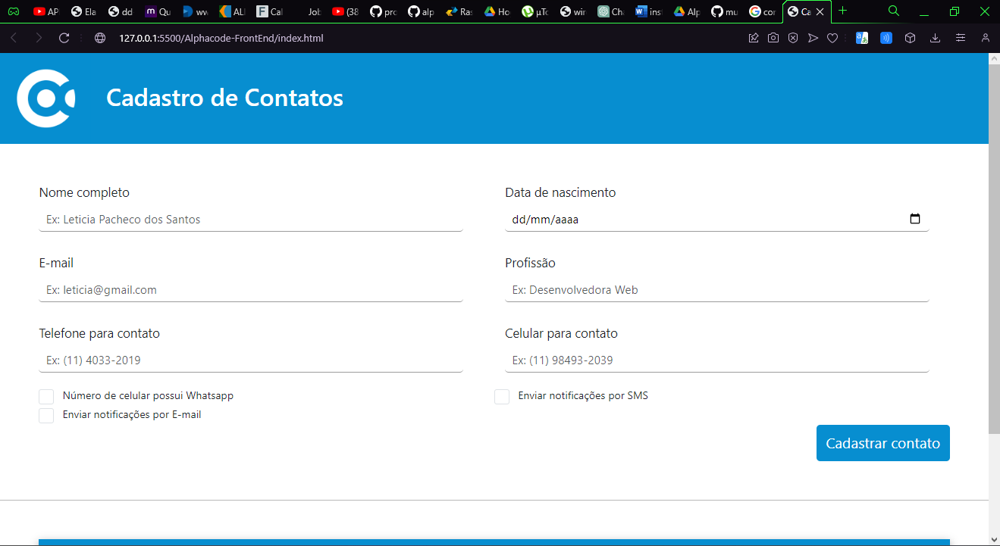
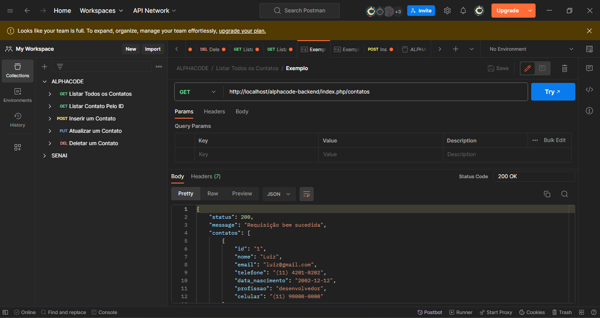

# Projeto Alphacode




## Banco de Dados

O script do banco de dados utilizado:

```sql

CREATE DATABASE alphacode_db;

USE alphacode_db;

CREATE TABLE tbl_usuario(
	id int not null auto_increment primary key,
	nome varchar(100) not null,
	email varchar(100) not null,
	telefone varchar(100) not null,
	data_nascimento date not null,
    profissao varchar(100) not null,
    celular varchar(100) not null,
    whatsapp boolean not null,
    notificacao_sms boolean not null,
    notificacao_email boolean not null,
		
	unique index(id)
);

```

---

## Como Rodar a Aplicação

- 1º Baixe o PHP, XAMPP e o Composer.
- 2º Após baixa-los, os configure.
- 3º Após ter configurado todos, pegue o clone do projeto e mova o back-end para a pasta htdocs de xampp em disco local (C:\xampp\htdocs).
- 4º Abra o projeto no seu editor de texto entre no arquivo de conexao com o banco de dados (alphacode-backend > model > bd > conexao_mysql.php) e mude o valor das variáveis de acordo com seu banco de dados.

```javascript
const SERVER = 'localhost';
const USER = 'root';
const PASSWORD = '78321875';
const DATABASE = 'db_alphacode';
```

- 5º Abra o XAMPP e inicie o Apache.
- 6º Abra o projeto front-end no editor de texto e execute o index.html com o Live Server.

Abaixo esta um vídeo explicativo sobre como realizar todas essas etapas.


---
## Tecnologias Utilizadas

- HTML
- CSS
- JavaScript
- Bootstrap
- MySQL
- XAMPP
- Composer
- PHP
- JQuery
- Postman

---
## Teste Postman

Foi utilizado o Postman para fazer os testes de cada endpoint da API.



---

## Aplicação Funcionando

Video da aplicação funcionando.

